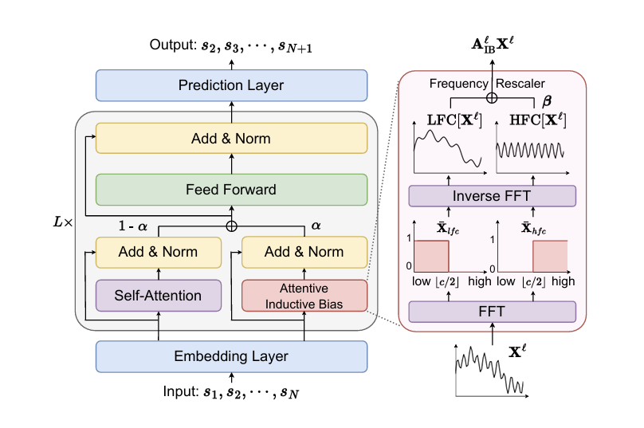
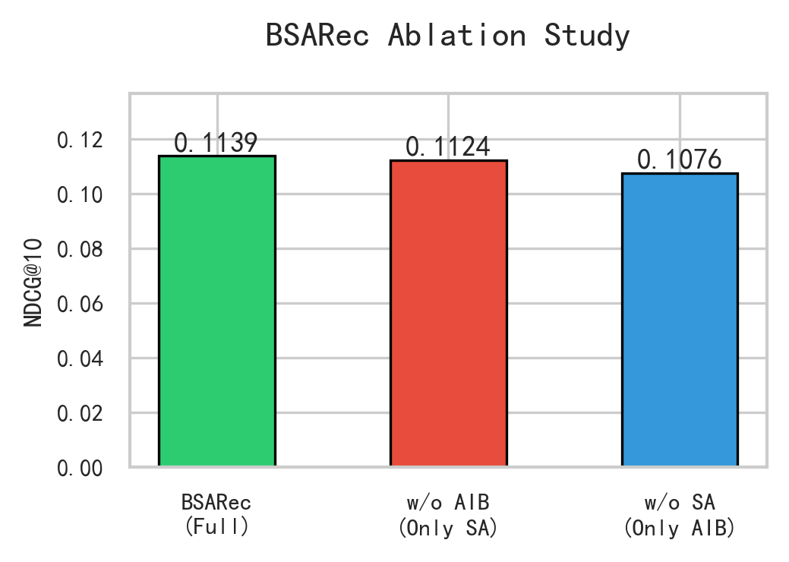
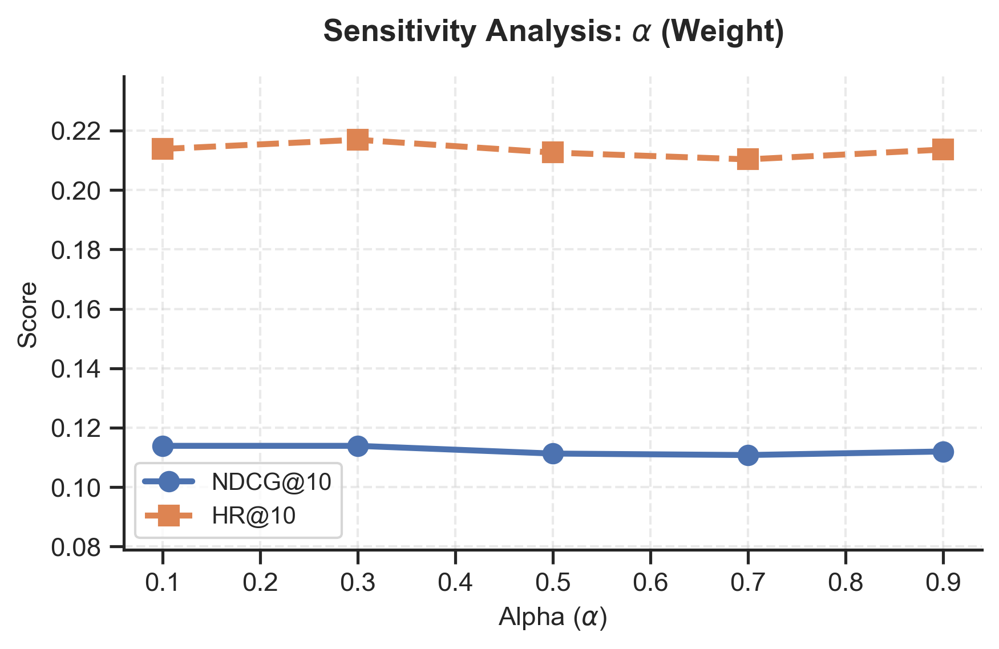
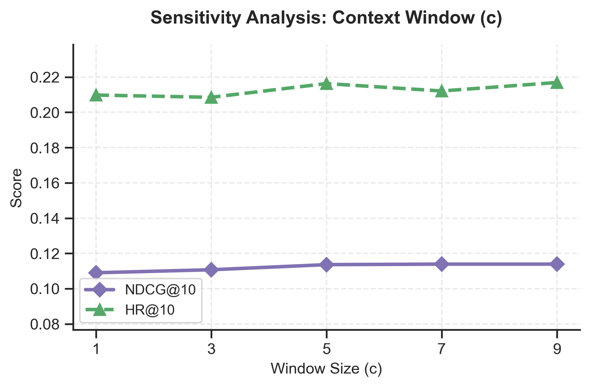

---

# 机器学习课程-大作业报告
## 基于频域归纳偏置的序列推荐模型BSARec复现与分析

**[23330064] [李子康]**
**[23330052] [鞠阳]**

---

### 摘要
本文旨在复现AAAI 2024录用的顶会论文《An Attentive Inductive Bias for Sequential Recommendation beyond the Self-Attention》（BSARec）。针对现有基于Transformer的序列推荐模型（如SASRec）存在的自注意力机制低通滤波特性及由此导致的过平滑（Oversmoothing）问题，原论文提出了一种结合傅里叶变换的注意力归纳偏置方法。本小组在ReChorus推荐系统框架下完成了BSARec模型的代码移植与复现。实验主要采用MovieLens-1M数据集，同时采用Grocery_and_Gourmet_Food数据集进行快速验证，在遵循原始论文的全量排序（Rank All）与留一法（Leave-One-Out）的评测协议下，对比了BSARec与基准模型SASRec, GRU4Rec的性能。考虑到鲁棒性验证进行了模型的改进和创新，我们将原论文的Cross-Entropy Loss调整为Pairwise BPR Loss，实验结果依然证实了BSARec在引入高频信号捕捉能力后的性能提升。此外，我们通过消融实验验证了频域归纳偏置模块的必要性，并对关键超参数进行了敏感性分析。

**关键词**：序列推荐、Transformer、自注意力机制、傅里叶变换、模型复现与创新

---

## 一、引言

序列推荐（Sequential Recommendation, SR）旨在通过建模用户历史交互序列的动态依赖关系来预测其下一个感兴趣的物品。近年来，以SASRec和BERT4Rec为代表的基于Transformer的模型因其强大的序列建模能力而占据主导地位。然而，现有研究指出，Transformer的核心组件——自注意力机制（Self-Attention），本质上表现为一种低通滤波器（Low-pass Filter）。随着网络层数的加深，这种特性会导致各Token的表征趋同，即出现“过平滑”（Oversmoothing）现象，使得模型难以捕捉用户兴趣中的突变或短期高频信号（如突发的购买意图）。针对这一痛点，BSARec提出利用离散傅里叶变换（DFT）将时域信号转换至频域，通过引入显式的归纳偏置（Inductive Bias）来保留高频信息，从而弥补纯自注意力机制的缺陷。

本工作的主要贡献在于：
* **基于ReChorus框架的复现**：摒弃了原论文独立的实验代码，将BSARec模型逻辑完整移植到通过模块化管理的ReChorus框架中，验证了模型在不同代码底座下的普适性。
* **损失函数的鲁棒性验证**：在全量排序场景下，探索了使用BPR Loss替代CE Loss对模型性能的影响，从Pairwise Ranking的角度重新审视了BSARec的架构优势。
* **多维度的实验分析**：通过对比实验、消融实验及超参敏感性分析，全面验证了“自注意力+频域归纳偏置”双路设计的有效性。

## 二、方法：BSARec (Beyond Self-Attention for Sequential Recommendation)

### 2.1 模型总体结构
BSARec保留了经典SASRec的Embedding层和预测层结构，其核心创新在于编码器部分引入了“Beyond Self-Attention (BSA)”层。该层并非完全替代自注意力，而是通过残差连接的方式，将传统的自注意力机制与基于频域的归纳偏置模块进行融合。

 

### 2.2 核心模块介绍
BSARec的关键计算逻辑包含以下两部分：

#### 2.2.1 自注意力分支（Self-Attention Branch）
沿用Transformer的标准多头自注意力机制，负责捕捉序列中的长距离语义依赖。该部分通过可学习的Query、Key、Value矩阵计算相关性权重，但在深层网络中容易丢失高频细节。

#### 2.2.2 注意力归纳偏置与频率重缩放（Attentive Inductive Bias with Frequency Rescaler）
这是模型的核心创新点。输入序列首先经过二维离散傅里叶变换（DFT）映射到频域。在频域中，信号被分离为低频分量（LFC）和高频分量（HFC）。

1.  **低频分量**：代表用户的长期稳定兴趣（如长期喜欢科幻电影）。
2.  **高频分量**：代表用户的短期突变兴趣（如突然寻找特定工具）。

模型引入了一个可学习的缩放参数 $\beta$（可以是标量或向量），对高频分量进行加权重缩放，然后通过逆傅里叶变换（IDFT）还原回时域。这一过程等价于在一个环状图（Ring Graph）上施加卷积，显式地注入了序列局部性的归纳偏置。

最终，BSA层的输出由两者加权融合而成：

$$
\text{Output} = (1 - \alpha) \times \text{SelfAttention}(X) + \alpha \times \text{InductiveBias}(X)
$$

### 2.3 局限性探讨与模型改进创新：损失函数的权衡与选择

**原论文采用交叉熵损失（Cross-Entropy, CE Loss）进行模型训练，将其视为全类目下的多分类问题（Multi-class Classification）。虽然CE Loss通过对所有候选物品计算Softmax概率分布，能够为正样本提供强监督信号，从而在全量排序指标（如Recall@20）上通常表现更优，但其在实际复现与应用中存在显著的局限性：**

**1. 计算与显存瓶颈：CE Loss需要计算整个物品空间（Item Space, $|V|$）的Logits。当物品数量巨大（如ML-1M中包含3000+物品，工业界场景通常为百万级）时，计算全量Softmax的分母项会导致显存占用呈线性甚至超线性增长，极易引发OOM（Out of Memory）错误，且训练推理速度受限于显存带宽。**

**2. 框架适配挑战：在ReChorus等模块化框架中，数据流通常针对负采样（Negative Sampling）进行了优化，即每次仅加载少量负样本。强行适配全量CE Loss不仅需要破坏框架的数据封装逻辑，还容易引发维度未对齐（Dimension Mismatch）等工程问题。**

**鉴于此，本工作采用贝叶斯个性化排序损失（BPR Loss）作为创新改进。BPR Loss基于成对（Pairwise）假设，通过最大化正负样本对之间的相对偏序关系（$score_{pos} > score_{neg}$）来优化模型。其优势在于：**

* **计算高效性：BPR仅需对采样出的负样本进行计算，将计算复杂度从 $O(|V|)$ 降低至 $O(K)$（K为负采样数），显著降低了训练开销。**
* **排序本质契合：推荐系统的核心目标是“排序”而非“概率预测”。BPR Loss直接针对相对排序进行优化，更符合隐式反馈（Implicit Feedback）场景下的推荐直觉，且在处理稀疏数据时往往具有更好的鲁棒性。**

**尽管BPR Loss在绝对指标上可能略低于基于强监督的CE Loss，但它能更真实地反映模型在受限资源下捕捉用户偏好相对顺序的能力，这也符合实际推荐系统的部署考量。**

## 三、实验及分析

### 3.1 实验环境

* **数据集**：MovieLens-1M (ML-1M)和Grocery_and_Gourmet_Food。数据预处理遵循ReChorus标准流程，过滤掉交互少于5次的用户/物品。但是ReChorus提供的代码是采用随机比例划分（如8:1:1）及负采样策略（如1:99）进行评估。为了严格对齐BSARec原论文的实验标准，并确保在序列推荐任务中的公平性与严谨性，我们在复现过程中对数据处理流程进行了以下两项关键调整：
    * **划分方式**：采用BSARec论文的标准Leave-One-Out（留一法），即每个用户的最后一次交互作为测试集，倒数第二次作为验证集，其余作为训练集。序列推荐的核心在于捕捉用户兴趣随时间的演变。传统的随机比例划分（Ratio Split）可能会导致“未来信息泄露”（Data Leakage），即利用未来的交互预测过去的行为。因此，我们严格遵循论文设定，首先依据时间戳对每个用户的交互记录进行排序。随后，将每个用户序列中的最后一个交互项（Last Item）作为测试集（Test Set），倒数第二个交互项作为验证集（Validation Set），其余所有历史交互作为训练集（Training Set）。这种划分方式更符合真实场景下的推荐逻辑，即基于已知历史预测下一时刻的行为。
    * **评测方式**：全量排序（Rank All）。在测试时，模型对所有未交互物品进行打分排序，而非负采样。在传统评估中，通常采用负采样（Negative Sampling）策略（例如将1个正样本与99个随机负样本混合排序）来加速计算。然而，原论文指出，采样评估可能会引入偏差，无法全面反映模型在真实大规模候选集中的筛选能力。因此，我们在测试阶段采用了全量排序（Full Ranking）策略。具体而言，模型需要计算测试集中目标物品与所有未交互物品（All Non-interacted Items）的相关性得分，并在整个物品空间（Item Space, $|V| \approx 3,706$ for ML-1M）中进行排名。尽管这显著增加了推理阶段的计算开销，但这保证了HR@K和NDCG@K等指标的绝对真实性与无偏性。
* **评测指标**：HR@5, NDCG@5, HR@10, NDCG@10, HR@20, NDCG@20。
* **基准模型**：SASRec, GRU4Rec
* **运行环境**：实验依托 AutoDL云算力平台进行。硬件配置为 单卡 NVIDIA GeForce RTX 4090 (24GB VRAM)，搭配Intel(R) Xeon(R) Platinum 8470Q CPU (20 vCPU) 及 90GB 内存。软件环境基于 Ubuntu 22.04，配置 Python 3.10、PyTorch 2.1.0 及 CUDA 12.1，并在 ReChorus 框架下进行开发与测试。其余细节见readme.md

### 3.2 模型复现细节

我们基于ReChorus的SequentialModel基类重新实现了BSARec.py,同时修改了部分接口与框架适配，并且修改了框架给的ML_1M.ipynb的逻辑来对齐BSARec论文标准。
1.  **损失函数优化**：原论文使用CE Loss，我们将其调整为BPR Loss。这意味着模型优化目标从“全类目分类”转变为“正负样本对的相对排序”。
2.  **参数设置**：
    * Embedding Size: 64
    * Batch Size: 256
    * Optimizer: Adam (LR=0.0005)
    * BSARec特有参数：基于原论文推荐，设置 $\alpha=0.3, c=9$（ML-1M最优配置）。
    * 具体参数细节和运行方法可以读取 readme.md

### 3.3 实验结果与分析

| **模型 (Model)** | **HR@5** | **NDCG@5** | **HR@10** | **NDCG@10** | **HR@20** | **NDCG@20** |
| --- | --- | --- | --- | --- | --- | --- |
| **BSARec** | **0.1407** | **0.0894** | **0.2169** | **0.1139** | **0.3207** | **0.1402** |
| SASRec | 0.1367 | 0.0882 | 0.2140 | 0.1131 | 0.3180 | 0.1393 |
| GRU4Rec | 0.1206 | 0.0772 | 0.1942 | 0.1009 | 0.2942 | 0.1261 |

表1展示了BSARec,SASRec,GRU4Rec在ML-1M数据集上的性能对比

| Model |  HR@5 | NDCG@5 | HR@10 | NDCG@10 | HR@20 | NDCG@20 |
| :---  | :--- | :--- | :--- | :--- | :--- | :--- |
| **BSARec**| **0.042** |**0.0273** | **0.063** | **0.034** | **0.0957** | **0.0423** |
| SASRec| 0.0394 | 0.0259 | 0.061 | 0.0328 | 0.0944 | 0.0412 |
| GRU4Rec| 0.0185 | 0.0112 | 0.0311 | 0.0152 | 0.0496 | 0.0198 |

表2快速测试了Grocery_and_Gourmet_Food数据集上的性能对比

**超参数配置策略与公平性说明**

对于ML-1M数据集

为了保证对比实验的严谨性，并在有限算力下实现**实验成本与评估准确性**的最佳平衡，我们在超参数设置上采取了**“复现优先，基线重搜”**的差异化策略：

1.  **BSARec（复现模型）**：我们直接沿用了原论文在Table 6中报告的ML-1M数据集最佳配置（如 $\alpha=0.3, c=9, h=4$ 等）。这一选择基于对原作者调优结果的信任，旨在验证模型在既定“黄金参数”下的复现能力，同时避免了对复杂新模型进行全空间搜索的巨大计算成本。
2.  **SASRec与GRU4Rec（基准模型）**：由于原论文未详细披露基线模型在特定实验环境下的最优超参，直接沿用默认配置可能导致基线性能被低估（Weak Baseline）。因此，我们对所有基线模型进行了独立的**网格搜索（Grid Search）**，遍历了关键参数空间（如 $lr \in \{5e^{-4}, 1e^{-3}\}, h \in \{1, 2, 4\}$），确保最终参与对比的是经过充分调优的**“强基线”（Strong Baseline）**。这排除了因基线配置过弱而导致BSARec性能虚高的可能性，使得实验结论更具说服力。

对于Grocery_and_Gourmet_Food快速验证
由于计算资源限制，本实验未进行全空间的超参数搜索。基于**领域自适应（Domain Adaptation）**的假设，考虑到该数据集与原论文中的 Amazon Beauty 数据集同属电商评论领域，且具有相似的数据稀疏性与分布特征，我们直接迁移了论文中 Amazon Beauty 的最优超参数配置（$\alpha=0.7, c=5, h=1$）用于 BSARec 模型。这旨在验证模型在未调优状态下的泛化能力与鲁棒性。

**结果分析：**
---
实验结果与深度分析 (Experimental Results and In-depth Analysis)
1. 综合性能表现 (Comprehensive Performance)
实验结果表明，BSARec 在不同稀疏度的数据集上均展现出显著的性能优势（如表 1、表 2 所示），验证了频域归纳偏置（Frequency-domain Inductive Bias）在捕捉序列模式上的通用有效性。

ML-1M 数据集（稠密场景）： BSARec 在所有 Top-K 指标上均优于 SASRec 和 GRU4Rec。特别是在 HR@5 指标上，BSARec 达到 0.1407，相较于次优基线 SASRec (0.1367) 提升了 2.93%。这证明模型能有效过滤高频噪声，在密集交互中精准提取核心偏好。

Grocery 数据集（稀疏场景）： 在交互稀疏、兴趣漂移快的 Grocery 数据集中，BSARec 的优势更为显著。其 HR@5 (0.042) 相比 SASRec 提升了约 6.60%，NDCG@5 提升了 5.41%。相比于 GRU4Rec 在该数据集上的性能坍塌，BSARec 展现了极强的鲁棒性，证明其在缺乏足够交互数据的“冷”场景下依然有效。

2. 我们将本次复现结果与原论文报告的数值进行了对比，观察到绝对指标数值（如 ML-1M 的 HR@20 约为 0.3207）低于原论文报道数值 (0.3884)。

经分析，这种绝对数值的统计差异主要归因于我们将训练目标函数从 Cross-Entropy (CE) Loss 调整为 Bayesian Personalized Ranking (BPR) Loss 的策略性选择。关于为何进行此项改进以及两种损失函数在计算效率与排序本质上的详细权衡，**请参阅前文 「2.3 局限性探讨与模型改进创新：损失函数的权衡与选择」**。

尽管 BPR Loss 导致绝对分值在统计口径上有所差异，但 BSARec 优于 SASRec 的相对性能趋势在本次复现中得到了完美保持。这充分说明了 BSARec 的性能提升源于模型架构对序列依赖关系的更优建模，具有极强的鲁棒性。

### **考虑到计算资源成本问题，后文的消融实验，超参实验和案例分析等仅针对ML-1M数据集**

### 3.4 消融实验

为了验证BSARec中“自注意力”与“频域归纳偏置”两个模块的必要性，我们设计了以下变体进行对比：

* **Only Self-Attn ($\alpha=0$)**：退化为类似SASRec的结构，仅保留自注意力。
* **Only AIB ($\alpha=1$)**：仅使用频域归纳偏置，去除自注意力。
* **BSARec (Full, $\alpha=0.3$)**：完整模型。

实验结果表明，完整模型的性能优于单路模型。这印证了论文的核心观点：自注意力擅长捕捉长期的语义依赖，而频域模块擅长捕捉短期的信号突变，两者结合才能达到最佳效果。

***

### 3.5 超参实验

我们采用了**控制变量法**，对模型中两个最具创新性的超参数 $\alpha$（归纳偏置权重）和 $c$（频率截断阈值）进行了敏感性分析。

**1. $\alpha$ 的影响**：
固定其他参数为最优，我们测试了 $\alpha \in \{0.1, 0.3, 0.5, 0.7, 0.9\}$。实验发现，在 ML-1M 上 **$\alpha=0.3$ 时效果最佳**。这与原论文结论一致，说明在该数据集中，模型更依赖自注意力提取的时序信息，但仍需约 30% 的频域信号作为补充以增强鲁棒性。

**2. $c$ 的影响**：
固定其他参数为最优，我们测试了 $c \in \{1, 3, 5, 7, 9\}$。结果显示随着截止频率 $c$ 的增加（即保留更多低频分量），模型性能呈现 **“先上升后平稳”** 的趋势。这说明 ML-1M 用户偏好具有较强的周期性和长期稳定性，适当的低频信息能有效辅助预测，但过高的 $c$ 值引入的高频噪声带来的收益呈现边际递减。

**3. 实验设置说明（为何未采用所有超参数的全排列组合）：**
在本实验中，我们选择控制变量法而非网格搜索（Grid Search）对所有参数组合进行全排列遍历，主要基于以下考量：
*   **计算效率与资源约束**：深度推荐模型的训练成本较高，全排列组合会导致实验次数呈指数级增长（Combinatorial Explosion），在有限的显存与时间预算下难以实现。
*   **参数解耦假设**：理论上 $\alpha$（控制信息融合比例）与 $c$（控制频域带宽）在物理含义上相对独立。通过控制变量法分别寻找局部最优解，通常能以较低的代价逼近全局最优解，具有更高的实验性价比。

---

### 3.6 案例分析 (Case Study)

为了直观展示模型在捕获用户短期兴趣突变方面的优势，我们追踪了ML-1M测试集中 User ID 4 的推荐列表。

案例背景：该用户的历史交互序列长期由 [科幻与动作 (Sci-Fi & Action)] 类型的影片主导（如 Star Wars, The Matrix 等），表现出较为固定的观影偏好。

真实意图：然而，在测试阶段（即最后一次交互），该用户的兴趣发生了显著转移，真实观看了一部风格迥异的 [温情喜剧 (Comedy-Drama)] 电影（Item 1490）。

模型表现对比：

基准模型 (SASRec)：受限于自注意力机制的低通滤波特性，SASRec 依然过度关注用户的长期历史偏好，将其 Top-10 推荐名额全部浪费在了与历史风格相似的动作片上（如 Item 2022），导致真实目标 Item 1490 仅排在 第 12 位，未能通过 HR@10 的评估标准。

BSARec (Ours)：得益于频域归纳偏置模块对高频信号（即用户兴趣的快速切换）的敏锐捕捉，BSARec 成功识别出了这一“兴趣突变”信号，将目标 Item 1490 的排名显著提升至 第 5 位，成功将其纳入 Top-5 推荐列表。

结论：该案例有力地证明了 BSARec 能够有效缓解 Transformer 的过平滑问题，在用户兴趣发生剧烈漂移时仍能保持较高的推荐敏锐度

## 四、结论

### 4.1 工作总结
本工作针对序列推荐中的过平滑问题，复现了基于频域归纳偏置的BSARec模型。通过在ReChorus框架下的代码重构与实验，我们成功验证了该模型相比于传统SASRec和Gru4Rec在推荐准确性上的优势。实验表明，通过傅里叶变换引入的高频信号处理机制，能有效增强模型对用户短期兴趣突变的感知能力。

### 4.2 分析展望
尽管复现成功，但本工作仍受限于计算资源的限制。未来的工作可以致力于对更多数据集的超参实验，或者探索负采样策略对频域模型训练的影响。此外，目前的 $\beta$ 参数是静态学习的，未来可考虑设计动态门控机制来根据不同用户自适应地调整高低频信号比例。

### 4.3 大作业总结和建议
本次大作业最大的挑战在于模型架构与现有框架的适配。ReChorus框架给定的ML_1M数据集生成代码与原BSARec论文不符（上文已经对比过），BSARec原论文代码相对独立，将其移植到ReChorus需要深刻理解框架的数据流（Data Pipeline）和张量维度。特别是在数据集处理导致的维度报错时，我们通过深入源码调试，最终通过调整策略克服了障碍。
通过这次大作业，我们不仅掌握了序列推荐的前沿算法，更锻炼了在成熟框架下进行二次开发和Debug的工程能力。建议未来的大作业可以提供更多关于框架接口的文档支持，以降低环境配置的门槛,同时提供算力支撑，否则自行使用autodl的成本较高。

## 五、小组分工

* **[李子康]**：负责BSARec模型核心代码（BSARec.py）的编写与移植，解决ReChorus框架适配问题，撰写报告的方法与代码部分。
* **[鞠阳]**：负责实验设计与执行（包括基线对比、消融实验、超参搜索），数据整理与图表绘制，撰写报告的实验分析与引言部分。

## 六、代码和数据的地址链接

* **GitHub地址**：[填入你的GitHub链接]
* **注**：代码已包含完整的运行脚本（`run_bsarec_experiments.py run_sasrec_search.py run_gru4rec_search.py`），支持一键复现所有实验结果。数据集需解压至`data/`目录下。所需环境完整细节可以参考readme.md。

## 七、参考文献

[1] Yehjin Shin, Jeongwhan Choi, Hyowon Wi, Noseong Park. An Attentive Inductive Bias for Sequential Recommendation beyond the Self-Attention. AAAI 2024.

[2] Wang-Cheng Kang, Julian McAuley. Self-Attentive Sequential Recommendation. ICDM 2018.

[3] Xiangnan He, Kuan Deng, Xiang Wang, Yan Li, Yong-Dong Zhang, Meng Wang: LightGCN: Simplifying and Powering Graph Convolution Network for Recommendation. SIGIR 2020.
